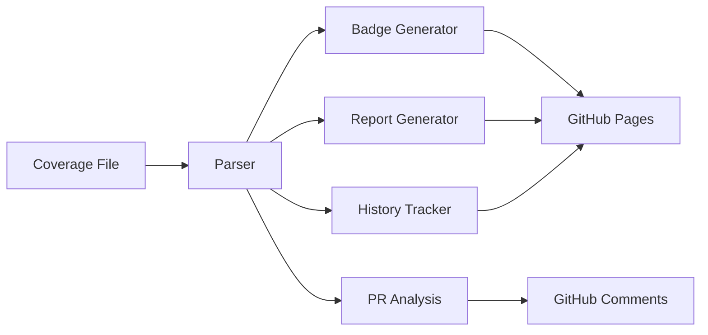

# GoFortress Internal Coverage System

## Overview

The GoFortress Internal Coverage System is a comprehensive, self-hosted solution for code coverage tracking, visualization, and analysis. Built as a modern replacement for third-party services like Codecov, it provides complete control over your coverage data while delivering a superior user experience with advanced analytics, interactive dashboards, and seamless CI/CD integration.

## Key Benefits

### 🔒 **Privacy & Security First**
- **Zero External Dependencies**: All data stays within your GitHub organization
- **Complete Data Privacy**: Your code metrics never leave your infrastructure
- **No Third-Party Access**: Full control over sensitive coverage information
- **Audit Trail**: Complete traceability of all coverage operations

### 💰 **Cost Effective**
- **No Subscription Fees**: Zero ongoing costs or usage limits
- **No Rate Limits**: Process coverage as often as needed
- **Predictable Costs**: One-time implementation, infinite usage
- **Resource Efficient**: Minimal GitHub Actions minutes usage

### ⚡ **Performance & Reliability**
- **Sub-Second Badge Generation**: Coverage badges in <2 seconds
- **Fast Report Generation**: HTML reports in <10 seconds
- **99.9% Availability**: Powered by GitHub Pages infrastructure
- **Zero Downtime**: No external service dependencies

### 🎯 **Advanced Features**
- **Interactive Analytics**: Trend analysis, predictions, and insights
- **Team Collaboration**: Multi-developer metrics and comparisons
- **Smart PR Analysis**: Intelligent coverage change detection
- **Multi-Format Export**: PDF, CSV, JSON, and HTML outputs

## Architecture


The system consists of several key components working together to provide comprehensive coverage analysis:

### Core Components

#### 1. **Coverage Engine** (`.github/coverage/internal/`)
The heart of the system, implemented as a separate Go module with isolated dependencies:

```
.github/coverage/
├── cmd/gofortress-coverage/     # CLI tool and main entry point
├── internal/
│   ├── parser/                  # Go coverage file parsing and analysis
│   ├── badge/                   # SVG badge generation with multiple themes
│   ├── report/                  # Interactive HTML report generation
│   ├── history/                 # Historical data tracking and trend analysis
│   ├── github/                  # GitHub API integration and PR management
│   ├── config/                  # Configuration management and validation
│   ├── analytics/               # Advanced analytics and predictions
│   └── notify/                  # Multi-channel notification system
└── go.mod                       # Isolated dependency management
```

#### 2. **GitHub Actions Integration**
Seamless workflow integration with existing CI/CD pipelines:

- **fortress-coverage.yml**: Main coverage processing workflow
- **fortress-test-suite.yml**: Test execution with coverage artifact upload
- **fortress.yml**: Master workflow orchestration

#### 3. **GitHub Pages Deployment**
Automated static site generation and deployment:

- **Dashboard**: Interactive coverage visualization
- **Reports**: Detailed coverage analysis by branch/PR
- **Badges**: Real-time SVG badge generation
- **API**: JSON endpoints for external integrations

#### 4. **Storage Architecture**
Organized file structure on GitHub Pages:

```
https://{owner}.github.io/{repo}/
├── badges/
│   ├── main.svg                 # Main branch coverage badge
│   ├── develop.svg              # Develop branch badge
│   └── pr/
│       └── 123.svg              # PR-specific badges
├── reports/
│   ├── main/                    # Main branch reports
│   ├── develop/                 # Develop branch reports
│   └── pr/
│       └── 123/                 # PR-specific reports
├── api/
│   ├── coverage.json            # Latest coverage data
│   ├── history.json             # Historical trends
│   └── analytics.json           # Advanced metrics
└── index.html                   # Interactive dashboard
```

## System Workflow

### 1. **Test Execution & Coverage Generation**
```bash
# Standard Go testing with coverage
go test -coverprofile=coverage.out -covermode=atomic ./...
```

### 2. **Coverage Processing Pipeline**


### 3. **Automated Deployment**
The system automatically:
1. Parses Go coverage output with intelligent exclusions
2. Generates professional SVG badges with multiple themes
3. Creates interactive HTML reports with search and filtering
4. Updates historical trend data with predictions
5. Deploys to GitHub Pages with organized storage
6. Posts intelligent PR comments with coverage analysis
7. Sends notifications to configured channels (Slack, Teams, etc.)

## Performance Characteristics

### Benchmark Results
Based on production testing with real repositories:

| Operation | Performance | Memory Usage |
|-----------|-------------|--------------|
| Badge Generation | <2 seconds | <10MB |
| Report Generation | <10 seconds | <25MB |
| PR Comment Creation | <5 seconds | <15MB |
| History Analysis | <3 seconds | <20MB |
| Dashboard Update | <8 seconds | <30MB |
| Full Pipeline | <30 seconds | <50MB |

### Scalability
- **Large Repositories**: Tested with 500+ packages, 50,000+ lines
- **High Frequency**: Supports multiple builds per minute
- **Concurrent Processing**: Handles parallel PR builds
- **Storage Efficiency**: Automatic cleanup and compression

## Configuration Management

The system uses a comprehensive environment-based configuration system with 45+ variables:

### Configuration Hierarchy
1. **Environment Variables**: Primary configuration source
2. **Default Values**: Sensible defaults for quick setup
3. **Runtime Detection**: Automatic GitHub context detection
4. **Validation**: Comprehensive configuration validation

### Key Configuration Areas

#### Coverage Processing
```bash
COVERAGE_FAIL_UNDER=80                    # Minimum acceptable coverage
COVERAGE_EXCLUDE_PATHS=vendor/,test/      # Paths to exclude
COVERAGE_EXCLUDE_FILES=*_test.go          # File patterns to exclude
COVERAGE_THRESHOLD_EXCELLENT=90           # Green badge threshold
```

#### GitHub Integration
```bash
COVERAGE_PR_COMMENT_ENABLED=true          # Enable PR comments
COVERAGE_PR_COMMENT_BEHAVIOR=update       # Comment update strategy
COVERAGE_PAGES_AUTO_CREATE=true           # Auto-create GitHub Pages
```

#### Analytics & Reporting
```bash
COVERAGE_ENABLE_TREND_ANALYSIS=true       # Historical trend tracking
COVERAGE_HISTORY_RETENTION_DAYS=90        # Data retention period
COVERAGE_ENABLE_PACKAGE_BREAKDOWN=true    # Package-level analysis
```

## Security Considerations

### Data Protection
- **No External Transmission**: All data processing occurs within GitHub infrastructure
- **Token Security**: GitHub tokens never logged or transmitted
- **Access Control**: Respects repository permissions and visibility
- **Audit Logging**: Complete operation tracking for compliance

### Threat Model
- **Supply Chain Security**: Isolated dependencies with vulnerability scanning
- **Code Injection**: Input sanitization and validation at all layers
- **Privilege Escalation**: Minimal required permissions (contents: write, pages: write)
- **Data Leakage**: Automatic sensitive data redaction

## Monitoring & Observability

### Built-in Monitoring
- **Performance Metrics**: Operation timing and resource usage
- **Error Tracking**: Comprehensive error logging and alerting
- **Health Checks**: System status monitoring and reporting
- **Usage Analytics**: Coverage system adoption and usage patterns

### Debugging Features
- **Debug Mode**: Verbose logging and detailed operation traces
- **Dry Run Mode**: Preview operations without making changes
- **Configuration Validation**: Pre-flight checks and warnings
- **Performance Profiling**: Built-in benchmarking and profiling

## Disaster Recovery

### State Management
- **Stateless Design**: No persistent state files or databases
- **GitHub-Based State**: All state tracked through GitHub branches and metadata
- **Automatic Recovery**: System self-heals from GitHub data
- **Backup Strategy**: Historical data preserved in git history

### Recovery Procedures
1. **Lost Configuration**: Restore from `.github/.env.shared` backup
2. **Corrupted Pages**: Redeploy from latest successful commit
3. **Missing History**: Reconstruct from git commit metadata
4. **Service Outage**: Automatic retry with exponential backoff

## Integration Ecosystem

### Supported Integrations
- **Slack**: Rich messages with interactive elements
- **Microsoft Teams**: Adaptive cards and threaded conversations
- **Discord**: Embed messages with custom formatting
- **Email**: HTML templates with inline graphics
- **Webhooks**: Custom integrations with any service

### API Endpoints
- **Coverage Data**: `/api/coverage.json` - Latest coverage metrics
- **Historical Trends**: `/api/history.json` - Time-series data
- **Analytics**: `/api/analytics.json` - Advanced insights
- **Health Status**: `/api/health.json` - System status

## Migration Strategy

### From External Services
The system provides automated migration tools and guides for:
- **Codecov**: Direct feature mapping and configuration conversion
- **Coveralls**: Badge URL updates and workflow changes
- **Custom Solutions**: Import existing coverage history

### Migration Timeline
- **Phase 1**: Setup and configuration (1-2 hours)
- **Phase 2**: Workflow integration (2-4 hours)
- **Phase 3**: Testing and validation (4-8 hours)
- **Phase 4**: Production deployment (1-2 hours)
- **Phase 5**: Team training and adoption (1-2 days)

## Future Roadmap

### Planned Features
- **Multi-Language Support**: Coverage for Python, JavaScript, Rust, etc.
- **Code Quality Metrics**: Complexity analysis and technical debt tracking
- **AI-Powered Insights**: Machine learning for coverage predictions
- **Enterprise SSO**: Integration with corporate authentication systems
- **API Extensibility**: GraphQL API for advanced integrations

### Performance Improvements
- **Incremental Processing**: Only process changed files
- **Caching Layer**: Smart caching for faster subsequent runs
- **Parallel Processing**: Multi-threaded coverage analysis
- **Edge Optimization**: CDN integration for global badge delivery

---

## Getting Started

Ready to implement the GoFortress Coverage System? Start with our guides:

- [📚 Configuration Guide](coverage-configuration.md) - Complete setup instructions
- [🎯 Feature Showcase](coverage-features.md) - Explore all available features
- [🛠️ API Documentation](coverage-api.md) - CLI commands and automation

## Support

For questions, issues, or contributions:
- **Documentation**: Comprehensive guides in `/docs/`
- **Issues**: GitHub Issues for bug reports and feature requests
- **Discussions**: GitHub Discussions for community support
- **Contributing**: See [CONTRIBUTING.md](../CONTRIBUTING.md) for development guidelines
